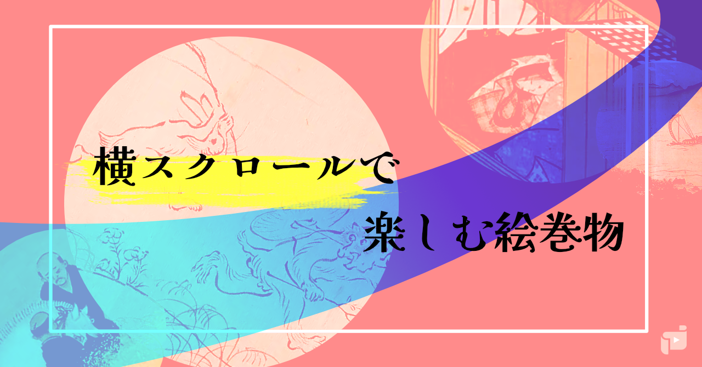
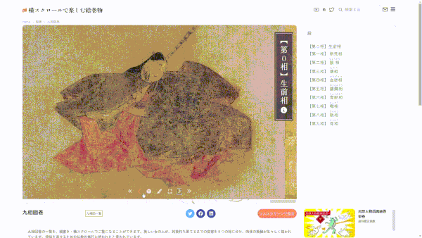

# 🎐 Emakimono: Horizontal Scroll Picture Scroll Viewer

Horizontal Scroll Emaki" is an open-source project exploring how traditional Japanese emakimono (picture scrolls) can be experienced on the web. It bridges cultural heritage and modern frontend technologies. This project inspired the CANW subproject: Horizontal Scroll Emaki

- 🌐 [Horizontal Scroll Emaki (CANW version)](https://github.com/satoshi-create/complexity-and-network-webdesign/tree/main/projects/horizontal-scroll-emaki)

---

## 🧭 Origin

This project began as a personal exploration of how emaki-style storytelling could live in the browser.  
It serves as the foundation for the [📜 Horizontal Scroll Emaki (CANW project)](https://github.com/satoshi-create/complexity-and-network-webdesign/tree/main/projects/horizontal-scroll-emaki),  
a cultural UI subproject within the CANW ecosystem.

> CANW = Complexity and Network Webdesign — exploring lifelike, cultural, and emergent interfaces.

---

## Usage

### 🎨 Screenshot

[📜Nine stages of decay（九相図巻）](https://emakimono.com/kusouzumaki)

### 🧭 How to Explore the Scroll

- The emaki scroll proceeds from left to right.
- On smartphones: swipe with your finger.  
  On desktop: use trackpad or shift + mouse wheel to scroll horizontally.
- Let the story unfold slowly — it’s meant to be experienced, not rushed.
- You can use navigation buttons or thumbnails to jump between scenes.
- Even if you're not familiar with Japanese culture, enjoy freely by interpreting the visuals!

📝 Read more on [note (in Japanese)](https://note.com/enjoy_emakimono/n/n449f765b4876)

---

## 📂 Project Structure

- `public/`: Scroll images (split into segments)
- `components/`: React components (Next.js)
- `pages/`: Homepage and viewer entry points
- `styles/`: CSS Modules
- `libs/`: Metadata files in JSON

---

## 🧠 Related Projects

- [📜 Horizontal Scroll Emaki (CANW Project)](https://github.com/satoshi-create/complexity-and-network-webdesign/tree/main/projects/horizontal-scroll-emaki)
- [🌐 CANW GitHub Repository](https://github.com/satoshi-create/complexity-and-network-webdesign)

---

## 💬 Get Involved

This project is open source and part of a broader ecosystem.

- Suggest improvements via [Issues](../../issues)
- Join conversations in [CANW Discussions](https://github.com/satoshi-create/complexity-and-network-webdesign/discussions)
- Explore new ideas via [Project Proposals](https://github.com/satoshi-create/complexity-and-network-webdesign/discussions/categories/-proposals)
  
---
## 📚 Documentation

For full documentation and contributor guides, please visit the [Emaki Project Wiki](https://github.com/satoshi-create/emakimono-next/wiki).

---
## 🌟 Contributors!

Thanks to all the contributors who help make Emakimono Project! 🌱

---

## 📘 License

MIT License  
(C) 2024 satoshi-create

