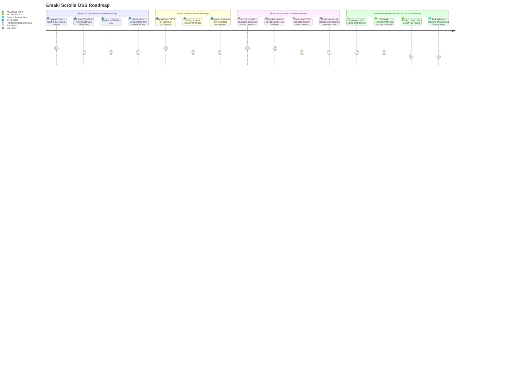

# 🎐 Emakimono: Interactive Picture Scroll Viewer

📘 Read this in other languages:

- [🇯🇵 日本語](./README_ja.md)

> **“Making every emakimono scroll interactively explorable.”**

This project reimagines traditional Japanese picture scrolls (emaki) as interactive digital experiences.  
It brings together frontend technology, storytelling, and cultural heritage — in an open, collaborative spirit.

🌟 Try the MVP site here:  
👉 [https://emakimono.com/](https://emakimono.com/)

---

## 🧭 Contribution Roadmap

We welcome contributors who share our vision to make cultural storytelling dynamic, accessible, and web-native.

The roadmap below shows an overview of the project's phased development.  
➡️ **For full descriptions of each phase, visit the [📍 Wiki Roadmap](https://github.com/satoshi-create/emakimono-next/wiki/Contribution-Roadmap)**

### 🗺 Roadmap Overview

---

## 🎨 Screenshot

> **Try the experience:**  
[📜 Nine Stages of Decay（九相図巻）](https://emakimono.com/kusouzumaki)

---

## 🧭 How to Explore the Scroll

- The scroll proceeds **left to right**, just like traditional emakimono.
- On smartphones: swipe with your finger.  
  On desktop: use trackpad or `shift + scroll` to move horizontally.
- Navigation buttons and thumbnail previews help you jump between scenes.
- Even if you don’t read Japanese, **feel free to interpret the imagery** intuitively!

📝 More stories on [note (in Japanese)](https://note.com/enjoy_emakimono/n/n449f765b4876)

---

## 🧠 Related Projects

- [📜 Horizontal Scroll Emaki (CANW Project)](https://github.com/satoshi-create/complexity-and-network-webdesign/tree/main/projects/horizontal-scroll-emaki)
- [🌐 CANW GitHub Repository](https://github.com/satoshi-create/complexity-and-network-webdesign)

---

## 💬 Get Involved

This project is open source and part of a broader ecosystem.

- Suggest improvements via [Issues](../../issues)
- Join conversations in [CANW Discussions](https://github.com/satoshi-create/complexity-and-network-webdesign/discussions)
- Explore new ideas via [Project Proposals](https://github.com/satoshi-create/complexity-and-network-webdesign/discussions/categories/-proposals)
  
---
## 📚 Documentation

For full documentation and contributor guides, please visit the [Emaki Project Wiki](https://github.com/satoshi-create/emakimono-next/wiki).

---
## 🌟 Contributors!

Thanks to all the contributors who help make Emakimono Project! 🌱

---

## 📘 License

MIT License  
(C) 2024 satoshi-create
