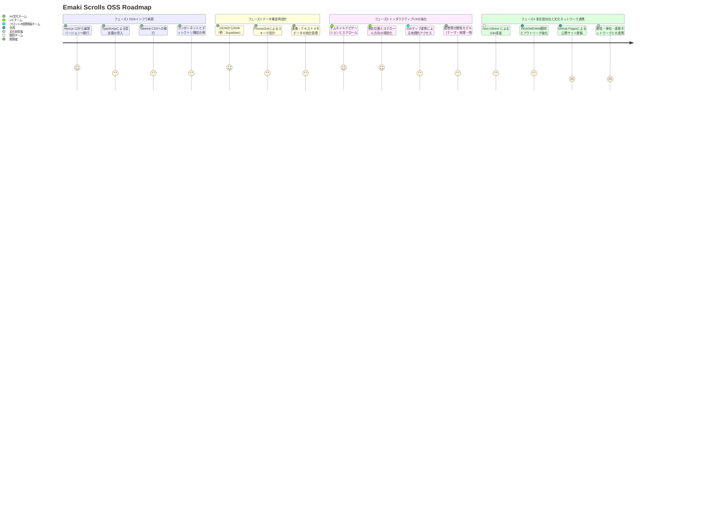

# 🎐 Emakimono：インタラクティブ絵巻物ビューア

📘 他の言語で読む:

- [🇺🇸 English](./README.md)

> **「すべての絵巻物を、インタラクティブに探索可能なものへ。」**

このプロジェクトは、日本の伝統的な絵巻物（絵巻）をインタラクティブなデジタル体験として再構築する試みです。フロントエンド技術、物語表現、文化遺産を結びつけ、オープンで協働的な精神に基づいて開発されています。

🌟 試してみる：  
👉 [https://emakimono.com/](https://emakimono.com/)

---

## 🧭 貢献ロードマップ

このプロジェクトでは、文化的ストーリーテリングを動的かつアクセスしやすく、ウェブネイティブにしていくというビジョンに共感するコントリビューターを歓迎しています。

以下は、開発フェーズの概要です。  
➡️ 各フェーズの詳細は [📍 Wikiのロードマップ](https://github.com/satoshi-create/emakimono-next/wiki/Contribution-Roadmap) をご覧ください。

### 🗺 ロードマップ概要

---

## 🎨 スクリーンショット

> **体験はこちら：**  
[📜 九相図巻](https://emakimono.com/kusouzumaki)

---

## 🧭 絵巻の操作方法

- 絵巻は伝統通り **左から右へ** とスクロールします。
- スマートフォンでは：指でスワイプ  
  デスクトップでは：トラックパッドや `shift + スクロール` で横移動
- サムネイルやナビゲーションボタンでシーン間をジャンプできます
- 日本語が読めなくても、**直感的に絵の物語を楽しめます！**

📝 [note にてストーリーを紹介中（日本語）](https://note.com/enjoy_emakimono/n/n449f765b4876)

---

## 🧠 関連プロジェクト

- [📜 Horizontal Scroll Emaki（CANWプロジェクト内）](https://github.com/satoshi-create/complexity-and-network-webdesign/tree/main/projects/horizontal-scroll-emaki)
- [🌐 CANW GitHubリポジトリ](https://github.com/satoshi-create/complexity-and-network-webdesign)

---

## 💬 参加する

このプロジェクトはオープンソースで、CANWという広範なエコシステムの一部です。

- [Issues](../../issues) から提案や改善を投稿
- [CANW Discussions](https://github.com/satoshi-create/complexity-and-network-webdesign/discussions) に参加
- [プロジェクト提案カテゴリー](https://github.com/satoshi-create/complexity-and-network-webdesign/discussions/categories/-proposals) にアイデアを投稿

---

## 📚 ドキュメント

詳細な仕様やコントリビューションガイドは、[Emaki Project Wiki](https://github.com/satoshi-create/emakimono-next/wiki) をご覧ください。

---

## 🌟 貢献者

Emakimonoプロジェクトに関わってくださるすべての皆さまに感謝します 🌱

---

## 📘 ライセンス

MITライセンス  
(C) 2024 satoshi-create
