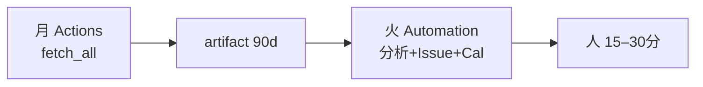

# Cursor Automation — Analytics weekly review

Pattern C の**分析〜Issue〜Calendar** 層。GitHub Actions fetch の翌日に動かす。

---

## 1. 前提

| 項目 | 状態 |
|------|------|
| GitHub Actions `analytics-weekly.yml` | 月曜 fetch + artifact |
| Repo Secrets | `GOOGLE_*`, `GSC_SITE_URL`（Actions 用） |
| Cloud Agent Secrets | 同上（Automation 内 fetch 用・推奨） |
| Skill | `.cursor/skills/analytics-review/` |
| Docs | `docs/operations/cursor-analytics-prompt.md` § Automation |

---

## 2. Automation 設定

> **Automations は Dashboard の一般メニュー（Cloud Agents / Billing 等）には出ないことがあります。**  
> 下記のいずれかから開いてください。

### 開き方（優先順）

| 方法 | 手順 |
|------|------|
| **A. 直接 URL** | ブラウザで [cursor.com/automations](https://cursor.com/automations) または [cursor.com/automations/new](https://cursor.com/automations/new) |
| **B. Agents Window（IDE）** | Cursor **3.5+** → Command Palette → **Agents Window** → **Automations** タブ |
| **C. チャットから** | Agent に「Automations エディタを開いて」と依頼（IDE 内 Agents Window が必要） |

### 表示されない場合の原因

| 原因 | 確認・対処 |
|------|-----------|
| **Cursor が古い** | Help → About Cursor。**3.5 未満**なら [cursor.com/download](https://cursor.com/download) で更新 |
| **Cloud Agents 非対応プラン** | Automations は **Cloud Agent 上**で動く。Pro（有料）以上が必要な場合あり。[Pricing](https://cursor.com/pricing) を確認 |
| **Dashboard の別タブを見ている** | `Dashboard → Cloud Agents` ≠ Automations。**`/automations` URL** を直接開く |
| **Agents Window 未使用** | 通常の Chat パネルには Automations タブは無い |

### Automations が使えない場合（代替: GitHub のみ Pattern C）

Cursor Automation の代わりに **GitHub Actions だけ**で週次ループ可能:

| 曜日 | GitHub Actions |
|------|----------------|
| 月 | **Analytics weekly fetch**（cron または手動） |
| 火 | **Analytics weekly review**（`dry_run: false` で Issue 作成） |
| 人 | Issues レビュー 15 分（[checklist](./analytics-weekly-checklist.md)） |
| Calendar | **手動**（Google Calendar に 30 分予約）または Cursor チャット + google-calendar MCP |

LLM による深い分析が必要なときは、Cursor **通常チャット**に [cursor-analytics-prompt.md](./cursor-analytics-prompt.md) **§1** を貼る。

---

### 設定値（Automation を使う場合）

| 項目 | 値 |
|------|-----|
| **Name** | Analytics weekly review |
| **Repo** | `satoshi-create/emakimono-next` / `main` |
| **Schedule** | 火曜 10:00 JST（UTC 火曜 01:00） |
| **Skill** | analytics-review |
| **MCP** | google-calendar（dashboard 連携。未設定なら Editor で追加） |

### Cloud Agent Secrets（推奨）

Automation プロンプト内で `fetch_all.py` を再実行する場合、Cursor Cloud の Secrets に以下を登録:

- `GOOGLE_APPLICATION_PROPERTY_ID`
- `GOOGLE_CREDENTIALS_BASE64`
- `GSC_SITE_URL`

artifact のみ使う場合は fetch ステップをプロンプトから省略可（Actions artifact の手動 DL は Automation では未対応のため、**Cloud fetch 推奨**）。

---

## 3. プロンプト

正本: [`cursor-analytics-prompt.md`](./cursor-analytics-prompt.md) の **§4 Cursor Automation（週次）** を Automation の Instructions に貼る。

---

## 4. Google Calendar

- **Calendar:** lifelog（またはレビュー用カレンダー）
- **イベント:** 1 週間後、30 分、`[emakimono-next] Analytics weekly review`
- **説明:** GitHub Issues `analytics-weekly` フィルタ URL

lifelog の calendar ID は Automation 実行時に MCP で解決するか、プロンプトに固定 ID を記載。

---

## 5. GitHub Issues

Automation は `gh issue create` で P1–P3 を作成:

- label: `analytics-weekly`, `analytics-p1`（等）
- 本文に `actions.md` の該当段落 + レポート日付

初回: [analytics-weekly-checklist.md](./analytics-weekly-checklist.md) の `gh label create` を実行。

---

## 6. 試運転

### GitHub Actions（Automation Run once の機械部分）

Cursor Automation の前に、GitHub 上で同じ経路を smoke test できます。

1. Actions → **Analytics weekly review** → Run workflow
2. 初回: `dry_run: true`（デフォルト）→ `actions.md` / artifact 確認
3. 2 回目: `dry_run: false` → Issues + ラベル自動作成を確認
4. Job summary の Next steps を確認

| Input | 説明 |
|-------|------|
| `dry_run` | `true` = Issue 作成しない（デフォルト） |
| `skip_fetch` | `true` = fetch 省略（runner 上に merged.json が無いので通常 false） |

### Cursor Automation

1. Actions → **Analytics weekly fetch** → Run workflow（fetch のみ未実施なら）
2. Automation → Run once（手動トリガー）
3. Issues / Calendar / 実行ログを確認
4. [analytics-weekly-checklist.md](./analytics-weekly-checklist.md) で 15 分レビュー

---

## 7. 週次ループ

---

## 8. トラブルシュート

| 症状 | 対処 |
|------|------|
| fetch 403 | GSC 権限・API 有効化 |
| Automation が reports を見つけない | Cloud Secrets で fetch 再実行 |
| Calendar 作成失敗 | MCP 認証を Cursor Settings → MCP で更新 |
| Issue ラベルエラー | `gh label create` 未実行 |
| **Dashboard に Automations が無い** | [cursor.com/automations](https://cursor.com/automations) を直接開く。不可なら §2「GitHub のみ Pattern C」 |
