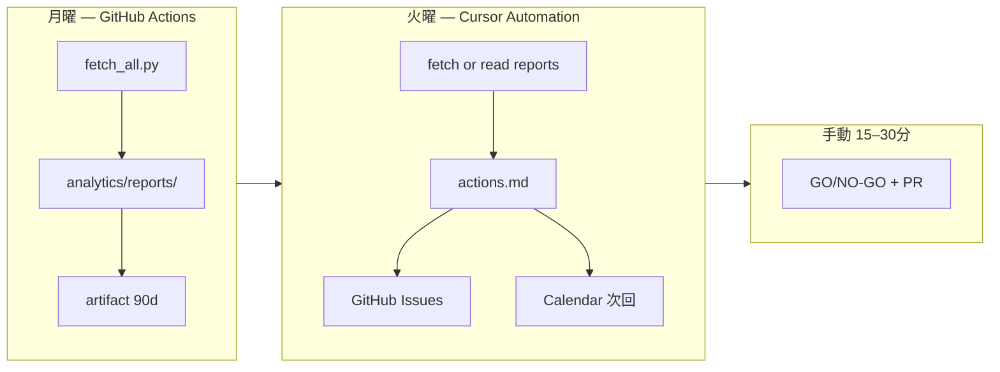

# GSC / GA4 分析パイプライン

**自動取得パイプラインの正本。** GSC + GA4 を API で取得し、`analytics/reports/` に JSON を保存して Cursor Agent が分析します。

| 用途 | ドキュメント |
|------|-------------|
| 手順・運用（本書） | `analytics-pipeline.md` |
| Cursor Agent 用プロンプト | [`cursor-analytics-prompt.md`](./cursor-analytics-prompt.md) |
| **週次ループ（Pattern C）** | [`analytics-automation-setup.md`](./analytics-automation-setup.md) |
| **人間 15 分チェックリスト** | [`analytics-weekly-checklist.md`](./analytics-weekly-checklist.md) |
| 絵巻 sync パイプライン | [`scroll-pipeline.md`](./scroll-pipeline.md) |

---

## 1. 運用方針

| フェーズ | 条件 | 内容 |
|----------|------|------|
| **bootstrap** | GSC 行数 / GA4 セッションが閾値未満 | 計測健全性・ベースライン保存 |
| **steady** | 閾値超え | 週次改善レビュー |

閾値は `analytics/kpi.yaml` の `bootstrap` セクション。

**集計期間:** 週次 fetch は **直近 7 日**を 1 リクエストで集計（日次 Actions 不要）。

---

## 2. 全体フロー（Pattern C）



---

## 3. 初回セットアップ

### GCP で API を有効化

| API | リンク |
|-----|--------|
| **Google Search Console API** | [Enable](https://console.cloud.google.com/apis/library/searchconsole.googleapis.com) |
| **Google Analytics Data API** | [Enable](https://console.cloud.google.com/apis/library/analyticsdata.googleapis.com) |

**403 `accessNotConfigured`:** Search Console API が未有効化。

### 環境変数

**ローカル（`.env.local`）:**

```env
GOOGLE_APPLICATION_PROPERTY_ID=<GA4 property numeric ID>
GOOGLE_CREDENTIALS_BASE64=<base64 service account JSON>
GSC_SITE_URL=sc-domain:emakimono.com
```

**GitHub Actions Secrets**（Repository → Settings → Secrets）:

| Secret | 内容 |
|--------|------|
| `GOOGLE_APPLICATION_PROPERTY_ID` | 同上 |
| `GOOGLE_CREDENTIALS_BASE64` | 同上 |
| `GSC_SITE_URL` | **`sc-domain:emakimono.com`**（ドメインプロパティ。`https://` 不可） |

### 依存関係

```powershell
py -3.14 -m pip install -r scripts/requirements-analytics.txt
```

### 設定確認

```powershell
$env:PYTHONIOENCODING = "utf-8"
py -3.14 scripts/analytics/check_analytics_config.py
py -3.14 scripts/analytics/fetch_all.py --date 2026-07-24
```

---

## 4. 週次取得

### ローカル

```powershell
$env:PYTHONIOENCODING = "utf-8"
py -3.14 scripts/analytics/fetch_all.py
py -3.14 scripts/analytics/fetch_all.py --date 2026-07-24
```

### GitHub Actions

Workflow: `.github/workflows/analytics-weekly.yml`

| トリガー | 説明 |
|----------|------|
| cron | 毎週月曜 06:00 JST |
| workflow_dispatch | 手動（任意 `report_date`） |

成果物: `analytics-report-{date}` artifact（90 日保持）。`analytics/reports/` は gitignore のため **commit されない**。

---

## 5. 関連ファイル

| ファイル | 役割 |
|---------|------|
| `analytics/project.yaml` | サイト URL・プロパティ ID |
| `analytics/kpi.yaml` | レポート定義・7 日 window |
| `analytics/dimensions.yaml` | GA4 イベント ↔ コード対応 |
| `scripts/analytics/fetch_all.py` | **主経路** |
| `.github/workflows/analytics-weekly.yml` | 週次 cron fetch |
| `.github/workflows/analytics-weekly-review.yml` | Automation smoke test（Issue 作成検証） |
| `scripts/analytics/run_weekly_review.py` | actions 生成 + Issue 作成 |
| `src/libs/api/measurementUtils.js` | カスタムイベント送信 |

---

## 6. Cursor Agent / Automation

| 用途 | 参照 |
|------|------|
| 手動チャット | [`cursor-analytics-prompt.md`](./cursor-analytics-prompt.md) |
| 週次 Automation | [`analytics-automation-setup.md`](./analytics-automation-setup.md) |
| Skill | `.cursor/skills/analytics-review/SKILL.md` |
| 人間レビュー | [`analytics-weekly-checklist.md`](./analytics-weekly-checklist.md) |

---

## 7. チェックリスト

```
□ GA4 カスタムディメンション（emaki_id 等）登録済み（任意）
□ GSC にサービスアカウント追加済み
□ GitHub Secrets 3 件登録
□ check_analytics_config.py OK
□ Actions workflow_dispatch で artifact 確認
□ Actions **Analytics weekly review** dry_run で smoke test
□ Actions **Analytics weekly review** dry_run=false で Issue 確認
□ Cursor Automation 試運転
□ gh label create（analytics-weekly 等）
□ 初回 15 分レビュー完了
```

---

## 8. トラブルシュート

| 症状 | 対処 |
|------|------|
| GSC permission denied | サービスアカウントを GSC プロパティに追加、`GSC_SITE_URL` を `sc-domain:` 形式に |
| GSC 400 invalid argument | Secret が `https://emakimono.com/` 等になっている → **`sc-domain:emakimono.com`** に修正（前後空白・引用符なし） |
| GA4 403 | Data API 有効化・プロパティ ID 確認 |
| merged で slug 重複 | URL エンコード差 — `_util.normalize_slug` で統合済み。レガシー slug は別行のまま |
| Actions 失敗 Issue | Secrets / API 有効化を確認し workflow_dispatch で再実行 |
