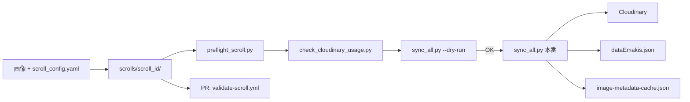

# 絵巻同期パイプライン

**自動化パイプラインの正本。** Supabase を使わず、**YAML + ローカル画像 → Cloudinary → JSON** で絵巻を追加・更新します。

| 用途 | ドキュメント |
|------|-------------|
| 手順・CI・運用（本書） | `scroll-pipeline.md` |
| Cursor Agent 用 sync プロンプト | [`cursor-scroll-sync-prompt.md`](./cursor-scroll-sync-prompt.md) |
| YAML 草案（汎用 AI プロンプト） | [`ai-scroll-config-prompt.md`](./ai-scroll-config-prompt.md) |
| Cloudinary B 形式命名 | [`naming-convention.md`](./naming-convention.md) |
| 旧 Supabase 時代の手順 | [`../archive/github-actions-sync-manual.md`](../archive/github-actions-sync-manual.md) |

---

## 目次

1. [運用方針](#1-運用方針)
2. [全体フロー](#2-全体フロー)
3. [レーン A：1 絵巻追加](#3-レーン-a1-絵巻追加)
4. [YAML・词書スキーマ](#4-yaml词書スキーマ)
5. [スクリプトとフラグ](#5-スクリプトとフラグ)
6. [GitHub Actions](#6-github-actions)
7. [レーン B：UI リファクタ](#7-レーン-bui-リファクタ)
8. [チェックリスト](#8-チェックリスト)
9. [モニタリング](#9-モニタリング)
10. [Cursor Agent プロンプト例](#10-cursor-agent-プロンプト例)
11. [付録 A: sync_scroll.py CLI](#付録-a-sync_scrollpy-cli)
12. [付録 B: 関連ファイル](#付録-b-関連ファイル)

---

## 1. 運用方針

Free プラン（Cloudinary / Vercel Hobby）の上限内で、**1 絵巻 ≒ 10 枚**を少しずつ追加しつつ UI 改善も進める方針です。

### 2 つの上限

| サービス | 主な上限 | モニタリング先 |
|----------|----------|----------------|
| **Cloudinary Free** | 月 25 クレジット、Admin API 500/月 | `check_cloudinary_usage.py`、Console Usage Reports |
| **Vercel Hobby** | Fast Data Transfer ~100 GB、Edge Requests ~1M 等 | Vercel Dashboard → Usage |

**配信の分担:**

```
[ユーザー] ── HTML/JS/CSS ──→ Vercel
[ユーザー] ── 絵巻画像 ─────→ Cloudinary CDN（LazyImage custom loader）
```

絵巻画像の帯域・Impressions は **Cloudinary** に計上され、Vercel Usage には含まれません。

### 2 レーンに分ける

コンテンツ追加と UI リファクタを **同じ PR・同じ週に混ぜない** ことを推奨します。

| レーン | 内容 | Cloudinary | 頻度目安 |
|--------|------|------------|----------|
| **A: コンテンツ追加** | YAML + 画像 → sync → JSON | アップロードあり | **月 2〜3 絵巻** |
| **B: UI リファクタ** | コンポーネント・レイアウト改善 | 触らない（URL 固定） | 随時 |

**ルール:**

- sync した週は **Cloudinary loader の URL パラメータを変えない**
- UI を大きく変えた週は **新絵巻の sync を控える**

### 月間バジェット（目安）

| 操作 | 1 絵巻（10 枚）あたり目安 |
|------|--------------------------|
| アップロード | Admin API ~10 回、クレジットほぼ 0 |
| ストレージ | +40〜80 MB → ~0.04〜0.08 クレジット |
| 初回アクセス後の帯域 | トラフィック次第（**クレジット主因**） |

**目安:** `credits.usage` が **18 未満** なら新絵巻追加 OK。**20 超** でペースを落とす。

---

## 2. 全体フロー



**Windows では `py -3.14` を使う**（Store の `python` スタブを避ける）。以降の例は `$env:PYTHONIOENCODING = "utf-8"` を前提とします。

---

## 3. レーン A：1 絵巻追加

### Phase 0: 事前チェック

```powershell
$env:PYTHONIOENCODING = "utf-8"
py -3.14 scripts/preflight_scroll.py scrolls/my-new-scroll/scroll_config.yaml
py -3.14 scripts/check_cloudinary_usage.py --warn-at 18 --fail-at 20 --no-save
```

| ツール | Cloudinary API | 役割 |
|--------|----------------|------|
| `preflight_scroll.py` | **呼ばない** | 枚数・重複・10MB・フォルダ名一致 |
| `check_cloudinary_usage.py` | Admin API **1 回** | sync 前ゲート（`--warn-at` / `--fail-at`） |

検証のみ（ファイル書き込みなし）:

```powershell
py -3.14 scripts/sync_all.py scrolls/my-new-scroll/scroll_config.yaml --preflight
```

**画像の事前条件（Cloudinary Free）:**

| 条件 | preflight | 備考 |
|------|-----------|------|
| 各ファイル ≤ 10 MB | 自動 | |
| `scroll_id` = フォルダ名 | 自動 | `_template` 等は除外 |
| `metadata.id` / `titleen` 重複なし | 自動 | `dataEmakis.json` と照合 |
| 解像度 ≤ 25 MP | **手動** | preflight 未実装 |
| 高さ 1080px 前後 | **手動** | `_01-1080.jpg` 形式で可 |

### Phase 1: ローカル準備（Cloudinary に触らない）

```powershell
Copy-Item -Recurse scrolls\_template scrolls\my-new-scroll
# または
py -3.14 scripts/create-project.py my-new-scroll
```

1. `scrolls/{scroll_id}/scroll_config.yaml` を編集
2. `scrolls/{scroll_id}/images/` に画像を配置
3. 词書が必要なら `scenes[].text` を YAML に記述

**外部ソース（Wikimedia Commons 等）から画像を用意する場合** — 元画像をダウンロードし、sharp で高さ 1080px に縮小して `_NN-1080.jpg` 形式で配置します:

```powershell
# ダウンロード（例: Wikimedia Commons）
curl.exe -s -L -o "scrolls\{scroll_id}\images\src-01.jpg" "https://commons.wikimedia.org/wiki/Special:FilePath/XXX.jpg"

# 1080px 高に縮小 → _01-1080.jpg（sync_scroll.py が自動検出）
node -e "require('sharp')('scrolls/{scroll_id}/images/src-01.jpg').resize({height:1080}).jpeg({quality:85}).toFile('scrolls/{scroll_id}/images/_01-1080.jpg')"
```

- 対象物が **縦長（portrait）** の場合、16:9 サムネイルでは中央帯だけが使われるため、代表シーン選定時に考慮する（`docs/operations/thumb-workflow.md` 参照）
- 枚数が多い場合は `scrolls/_tmp-*/` に一時ファイルを置いてから変換する

YAML 草案: [`ai-scroll-config-prompt.md`](./ai-scroll-config-prompt.md)  
命名規則: [`naming-convention.md`](./naming-convention.md)

### Phase 2: ドライラン（必須）

```powershell
py -3.14 scripts/preflight_scroll.py scrolls/my-new-scroll/scroll_config.yaml
py -3.14 scripts/sync_all.py scrolls/my-new-scroll/scroll_config.yaml --dry-run
```

本番 `sync_all.py` 実行時も preflight が **自動で先に走ります**（`--skip-preflight` で省略可）。

確認:

- [ ] `public_id` が B 形式（`scroll-id__scroll-id_1_01__01`）
- [ ] 画像枚数 = `scenes` range 合計
- [ ] `titleen` / `metadata.id` が既存と被らない

### Phase 3: 本番 sync（1 回だけ）

```powershell
# .env.local に CLOUDINARY_URL を設定済みであること
py -3.14 scripts/sync_all.py scrolls/my-new-scroll/scroll_config.yaml
```

`sync_all.py` が実行する処理:

1. preflight（自動）
2. Cloudinary へアップロード（`sync_scroll.py`）
3. `scenes[].text` から `emaki-text-data/{titleen}.json` を生成
4. `dataEmakis.json` を upsert（`titleen` キー）— **保存先は `local-data/pipeline/`（gitignore + cursorignore 済み）。git commit 対象外**
5. `image-metadata-cache.json` を upsert（同 scroll のみ）

**禁止・非推奨:**

| フラグ / 操作 | 理由 |
|---------------|------|
| `--force-upload` | 全件再アップロード。Admin API・クレジットを浪費 |
| `--remote-check` | Admin API 増加。通常は `.upload-cache.json` で十分 |
| `--regenerate-cache` | `generateImageMetadata.js` の全再生成は現行 cache の Cloudinary 移行後形式（`v1775033725/emakimono/...`）を旧形式に巻き戻す。**通常は upsert（`--skip-upload`）で対象 scroll のみ更新** |
| 同じ絵巻の sync ループ | 二重処理・上限消費 |

成功後の更新物:

- `local-data/pipeline/dataEmakis.json`
- `src/data/image-metadata-cache/image-metadata-cache.json`（構造のみ。テキストは埋め込まない）
- `src/data/emaki-text-data/{titleen}.json`（`scenes[].text` から生成。表示はこのファイルが正本）
- `scrolls/{scroll_id}/.upload-cache.json`（gitignore・再 sync 時のスキップ用）

**再 sync の安全性（preserve 動作）:** `sync_all.py` は YAML 由来のフィールドのみを上書きし、既存 JSON にある**スクリプトが生成しないフィールド**（`personname` / `kusouzuslug` / `sourceAuthor` / `sourceCollection` / `sourceLicense` 等）は保持します。YAML・词書だけを直す再 sync（`--skip-upload`）で手編集フィールドが消えることはありません。

新規にこのようなフィールドを追加するときは、**JSON を手編集せず YAML に追記して再 sync** するのが正（`personname` は slug 配列で personprofiles.json から自動展開、`kusouzuslug` は段 ID 配列）。

### Phase 4: ローカル確認 → PR

1. `npm run dev` で `/[titleen]` を開く
2. 横スクロール・词書・段数を目視
3. YAML + images + JSON を **同一 PR** で commit
4. PR 上で `validate-scroll.yml` が preflight + dry-run を自動実行

### Phase 4b: サムネイル・OGP・人物ヒーロー（必要に応じて）

絵巻をトップカード・九相図/鳥獣ハブ・人物ページに正しく表示するため、sync 後に以下を実施します（詳細: [`thumb-workflow.md`](./thumb-workflow.md)）。

| 手順 | 内容 | 参照 |
|------|------|------|
| サムネイル | Figma で代表シーンを 1066×600 にクロップ → `generate-thumb-webp.js` → `public/thumb/{titleen}_thumb.webp` | `thumb-workflow.md` |
| JSON thumb 統一 | `dataEmakis.json` + `image-metadata-cache.json` の `thumb` / `thumb2` を実パスに統一 | `thumb-workflow.md` |
| OGP | `node src/script/generateOgImages.js` で SKIP 0 件に | `thumb-workflow.md` |
| 出典ライセンス | YAML の `metadata.sourceLicense`（例: `CC BY 4.0`）。指定時は出典表示のライセンス URL が対応する CC deed になる | `formatSourceAttribution.js` |
| 人物ヒーロー | `src/data/personname-data/personprofiles.json` の `heroCloudinary` で人物ページのヒーロー画像を個別指定 | `PersonProfile.js` |

> 絵巻のシーン画像が **縦長（portrait）** の場合は、16:9 サムネイルで中央帯のみ使われるため、代表シーンの選定で考慮する。2026-08 の Wellcome 九相図では、ヒーロー画像が縦長構図で PC 幅のクリップにより顔が切れる事象があり、Figma で 21:9 にトリムして解決した。

### Phase 5: sync 後モニタリング

```powershell
py -3.14 scripts/check_cloudinary_usage.py --warn-at 18 --fail-at 20
```

1 絵巻追加後の目安: credits +0.1〜0.3、storage +40〜80 MB。

---

## 4. YAML・词書スキーマ

### 必須フィールド

| フィールド | 説明 |
|-----------|------|
| `scroll_id` | kebab-case。フォルダ名と Cloudinary ID |
| `volume_num` | 巻番号 |
| `metadata.titleen` | URL スラッグ（既存ページと一致させる） |
| `metadata.id` | dataEmakis.json 内の数値 ID |
| `scenes` | 段定義。`range: [開始, 終了]` は **2 点指定** |

### 任意フィールド（出典・人物・ハブ連携）

`sync_all.py` が `metadata` から `dataEmakis.json` / `image-metadata-cache.json` へ反映します（無指定なら既存値が保持され、JSON 手編集は不要）。

| フィールド | 型 | 説明 |
|-----------|-----|------|
| `metadata.sourceAuthor` | string | 出典権利者（例: `Wellcome Collection`） |
| `metadata.sourceCollection` | string | 所蔵・コレクション名 |
| `metadata.sourceLicense` | string | ライセンス表記（例: `CC BY 4.0`）。指定時は出典表示のライセンス URL が対応 CC deed になる。未指定ならプロバイダ既定（Wikimedia = CC0 1.0） |
| `metadata.personname` | string[] | 人物 slug 配列（例: `["ononokomachi"]`）。personprofiles.json から自動展開（name/id/slug/ruby/portrait）。dict の配列でも可 |
| `metadata.kusouzuslug` | int[]/string[] | 九相段 ID 配列（例: `[0, 1, 3, 4, 6, 7, 8]`）。九相図ハブの段マッピングに使用 |

例（Wellcome 九相図）:

```yaml
metadata:
  sourceAuthor: "Wellcome Collection"
  sourceCollection: "Wellcome Collection（reference 766666i）"
  sourceLicense: "CC BY 4.0"
  personname: ["ononokomachi"]
  kusouzuslug: [0, 1, 3, 4, 6, 7, 8]
```

> preflight が `sourceLicense` の型・`personname` の slug 存在・`kusouzuslug` の型を検証します。

### 画像配置

```
scrolls/{scroll_id}/images/
  _01-1080.jpg
  _02-1080.jpg
  ...
```

旧ファイル名（`_01-1080.jpg` 等）でも可。連番が `_NN-` または `_NN.` 形式なら自動検出されます。

### 词書（`scenes[].text`）

`kotobagaki: true` の作品では、各 scene に `text` ブロックを YAML に含めます。

#### 词書レイアウト（3 パターン）

| `kotobagaki_mode` | 用途 | 完成例 |
|-------------------|------|--------|
| `"alternating"` | 词書画像と絵画が **交互**（地獄草紙型） | `scrolls/jigokusoushi-anzyuin/` |
| 省略（default） | **空 ekotoba + 絵画のみ**（餓鬼草紙型） | `scrolls/gakisoushi-kawamoto/` |
| `"explicit"` | **任意配置** — `scenes[].slots` で index ごとに指定（絵師草紙型など） | `scrolls/eshi-no-soshi/` |

**地獄草紙型（`alternating`）** — range 内で奇数 index → 词書（ekotoba+src）、偶数 → 絵画:

```yaml
metadata:
  kotobagaki: true
  kotobagaki_mode: "alternating"

scenes:
  - id: 1
    title: "第1段"
    range: [1, 2]
    text:
      gendaibun: |
        現代語訳（HTML可: <br>）
      kobun: ""
      desc: ""
```

**絵師草紙型（`explicit`）** — 交互でない配置（例: 絵→词書→絵×n、词書連続）向け。各 scene に `slots` を付け、**range 内の global index 順**に `image` または `ekotoba` を列挙します。`slots` の長さは `range` の枚数と一致必須（preflight が検証）。

```yaml
metadata:
  kotobagaki: true
  kotobagaki_mode: "explicit"

scenes:
  - id: 1
    title: "第1段"
    range: [1, 6]
    slots: [image, ekotoba, image, image, image, image]
    text:
      gendaibun: |
        現代語訳…
      kobun: ""
      desc: ""
  - id: 2
    title: "第2段"
    range: [7, 10]
    slots: [ekotoba, image, image, image]
    text:
      gendaibun: |
        …
```

- `ekotoba` スロット: `cat: ekotoba`（構造のみ。テキストは含めず、`emaki-text-data/{titleen}.json` が正本）+ 词書画像 src
- `image` スロット: `cat: image`（絵画）
- `range` / scene `id` は Cloudinary public_id（B 形式）の chapter 割当にそのまま使われるため、**layout 修正のみ**なら `--skip-upload` で JSON 再生成可

完成例 YAML: [`scrolls/_examples/eshi-no-soshi/`](../scrolls/_examples/eshi-no-soshi/scroll_config.yaml)（本番: [`scrolls/eshi-no-soshi/`](../scrolls/eshi-no-soshi/)）

`--skip-text` で词書 JSON 生成をスキップできます。

---

## 5. スクリプトとフラグ

### sync_all.py（統合パイプライン・主経路）

| フラグ | 説明 |
|--------|------|
| `--preflight` | preflight のみ（upload / ファイル書き込みなし） |
| `--skip-preflight` | sync 前の preflight を省略（**非推奨**） |
| `--dry-run` | 計画表示のみ |
| `--skip-upload` | Cloudinary スキップ。JSON のみ更新 |
| `--skip-cache` | キャッシュ更新スキップ |
| `--regenerate-cache` | 全 JSON からキャッシュ全再生成 |
| `--skip-text` | emaki-text-data JSON 生成スキップ |
| `--force-upload` | 全件再アップロード（**非推奨**） |

### preflight_scroll.py

```powershell
py -3.14 scripts/preflight_scroll.py scrolls/my-scroll/scroll_config.yaml
```

| チェック | 内容 |
|---------|------|
| フォルダ名 | `scroll_id` と一致 |
| scenes / range | 合計枚数・欠番・逆順 |
| 画像ファイル | range 分が `images/` に存在 |
| 10 MB 上限 | Cloudinary Free |
| ID 重複 | `metadata.titleen` / `metadata.id` vs `dataEmakis.json` |

### check_cloudinary_usage.py

```powershell
py -3.14 scripts/check_cloudinary_usage.py --warn-at 18 --fail-at 20 --no-save
```

| オプション | 意味 |
|-----------|------|
| `--warn-at N` | credits.usage ≥ N で警告 |
| `--fail-at N` | credits.usage ≥ N で **exit 1** |
| `--no-save` | `cloudinary-usage.json` を書かない |
| `--json` | フル JSON を stdout に出力 |
| `--date YYYY-MM` | 指定月の usage |

`cloudinary-usage.json` は `.gitignore` 対象。

---

## 6. GitHub Actions

### PR 検証 — `validate-scroll.yml`（upload なし）

**pull request** で自動実行。secrets 不要。

| 対象 path | 内容 |
|-----------|------|
| `scrolls/**` | 変更された `scroll_config.yaml` |
| `scripts/sync_*.py` | パイプライン変更 |
| `scripts/preflight_scroll.py` | 検証ロジック変更 |

**ジョブ内容:**

1. PR で変更された `scrolls/**/scroll_config.yaml` を列挙
2. 各ファイルで `preflight_scroll.py`
3. 各ファイルで `sync_all.py --dry-run --skip-preflight`

`scroll_config.yaml` の変更が 0 件の PR は **skip（success）**。usage チェック・upload は含みません。

### 手動 sync — `sync-scroll.yml`（upload は opt-in）

**`workflow_dispatch` のみ。** push トリガーはありません。

1. GitHub → Actions → **Sync scroll to Cloudinary** → Run workflow
2. **config_path**（必須）: `scrolls/my-scroll/scroll_config.yaml`
3. **skip_upload**: デフォルト **true**（JSON のみ）
   - CI からアップロードする場合のみ **false**（明示 opt-in）
4. Secrets: `CLOUDINARY_URL`（upload 時のみ必要）

**正攻法:** ローカルで sync → JSON を commit。CI からの二重アップロードに注意。

---

## 7. レーン B：UI リファクタ

### 固定しておくもの

`LazyImage.js` の Cloudinary 変換 URL:

```
fl_progressive,f_jpg,w_{width},q_75
```

リファクタ中は **このパラメータを変更しない**。レイアウト・`sizes`・スケルトン改善は OK。

### YAML / 词書だけ直す

```powershell
py -3.14 scripts/sync_all.py scrolls/my-scroll/scroll_config.yaml --skip-upload
```

### UI コードだけ直す

- `sync_all.py` は **実行しない**
- デプロイ前に既存絵巻 1〜2 作品で目視確認

### 避ける API

- `src/pages/api/updatejson.js` — 全画像の Admin API 一括取得
- `src/pages/api/cloudinary.js` — search API（max 500 件）

---

## 8. チェックリスト

```
□ kotobagaki あり: レイアウトに合った mode（alternating / 省略 / explicit+slots）
□ scroll_id がフォルダ名と一致
□ metadata.id / titleen が dataEmakis.json と重複しない
□ preflight_scroll.py が OK
□ 画像 ≤ 10MB（25MP は手動確認）
□ sync_all.py --dry-run OK
□ check_cloudinary_usage.py（--warn-at 18）OK
□ sync は 1 回（--force-upload なし）
□ ローカルで /[titleen] 確認
□ 出典ライセンス: sourceLicense（Wikimedia 既定 CC0。他は YAML で明示）
□ personname / kusouzuslug: YAML で宣言（JSON 手編集をしない）
□ サムネ・OGP 生成（thumb-workflow.md）/ 人物ヒーロー画像
□ dataEmakis.json + cache + emaki-text-data/{titleen}.json + YAML + images を同 PR
□ PR で validate-scroll.yml が pass
□ push では sync-scroll.yml は走らない（手動のみ）
```

---

## 9. モニタリング

### Cloudinary

```powershell
py -3.14 scripts/check_cloudinary_usage.py --warn-at 18 --fail-at 20
py -3.14 scripts/check_cloudinary_usage.py --json --no-save
```

| 信号 | 対処 |
|------|------|
| `credits.usage` **> 20** | 新絵巻追加を翌月まで延期 |
| Transformations 急増 | loader / `sizes` 変更を見直す |
| Admin API エラー | sync 停止、`--skip-upload` のみ |

### Vercel

Dashboard → **Usage** → Last 30 days。優先: Fast Data Transfer、Edge Requests、ISR Reads。

---

## 10. Cursor Agent プロンプト

コピー用のプロンプト集: **[`cursor-scroll-sync-prompt.md`](./cursor-scroll-sync-prompt.md)**

| 用途 | プロンプト |
|------|-----------|
| 新規絵巻 sync | 標準 / 短縮版 |
| 词書・YAML のみ修正 | `--skip-upload` |
| upload 前の検証 | 検証のみ |
| PR 前 | 最終確認 |
| UI 改善 | レーン B |

**YAML 草案（汎用 AI）:** [`ai-scroll-config-prompt.md`](./ai-scroll-config-prompt.md)

---

## 付録 A: sync_scroll.py CLI

`sync_all.py` から内部呼び出しされます。単体デバッグ用。

### 画像ディレクトリの自動検出

1. `SCROLL_IMAGES_DIR` 環境変数
2. config と同じフォルダの `images/`
3. `scrolls/{scroll_id}/images/`
4. `images/{scroll_id}/`
5. `public/images/{scroll_id}/`

### 古いファイル名の自動紐付け

- ファイル名中の `_NN-` または `_NN.` から global index を抽出
- 同 index に複数ファイル → **解像度の高い方を優先**（1080 > 800 > 375）

### 使い方

```powershell
pip install -r scripts/requirements-sync.txt
# .env.local または CLOUDINARY_URL

py -3.14 scripts/sync_scroll.py scrolls/my-scroll/scroll_config.yaml --dry-run
py -3.14 scripts/sync_scroll.py scrolls/my-scroll/scroll_config.yaml
```

**通常は `sync_all.py` を使う。** ドライランも `sync_all.py --dry-run` が正。

---

## 付録 B: 関連ファイル

| ファイル | 役割 |
|---------|------|
| `scripts/sync_all.py` | 統合パイプライン（**主経路**） |
| `scripts/preflight_scroll.py` | sync 前検証 |
| `scripts/check_cloudinary_usage.py` | usage 取得・ゲート |
| `scripts/sync_scroll.py` | Cloudinary アップロード |
| `scripts/migrate_cache_to_cloudinary.py` | キャッシュ修復 |
| `.github/workflows/validate-scroll.yml` | PR: preflight + dry-run |
| `.github/workflows/sync-scroll.yml` | 手動 sync（upload opt-in） |
| `docs/operations/cursor-scroll-sync-prompt.md` | Cursor Agent 用 sync プロンプト |
| `scrolls/README.md` | ワークスペース入口 |

---

## 旧ドキュメント（リダイレクト）

以下は本書に統合済み。ブックマーク更新を推奨します。

- `sync-workflow.md`
- `sustainable-content-and-ui-workflow.md`
- `sync-scroll.md`
