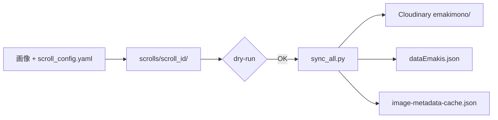

# 絵巻同期ワークフロー

Supabase を使わず、**YAML + ローカル画像 → Cloudinary → JSON** のパイプラインで絵巻を追加・更新します。

Free プラン内でコンテンツ追加と UI 改善を並行する運用方針: [`sustainable-content-and-ui-workflow.md`](./sustainable-content-and-ui-workflow.md)

## 全体フロー



## 1. プロジェクト作成

```powershell
# テンプレートをコピー
Copy-Item -Recurse scrolls\_template scrolls\my-new-scroll
```

または:

```powershell
python scripts/create-project.py my-new-scroll
```

## 2. 設定ファイル編集

`scrolls/{scroll_id}/scroll_config.yaml` を編集します。

**新規作成時**: 汎用 AI で段構成と YAML 草案を作る場合は [`ai-scroll-config-prompt.md`](./ai-scroll-config-prompt.md) のプロンプトを使用してください。

必須フィールド:

| フィールド | 説明 |
|-----------|------|
| `scroll_id` | kebab-case。フォルダ名と Cloudinary ID |
| `volume_num` | 巻番号 |
| `metadata.titleen` | URL スラッグ（既存ページと一致させる） |
| `metadata.id` | dataEmakis.json 内の数値 ID |
| `scenes` | 段定義。`range: [開始, 終了]` は2点指定 |

詳細: [`naming-convention.md`](./naming-convention.md)

## 3. 画像配置

```
scrolls/{scroll_id}/images/
  _01-1080.jpg
  _02-1080.jpg
  ...
```

旧ファイル名（`_01-1080.jpg` 等）でも可。連番が `_NN-` または `_NN.` 形式なら自動検出されます。

## 4. ドライラン

```powershell
$env:PYTHONIOENCODING = 'utf-8'
py -3.14 scripts/preflight_scroll.py scrolls/my-new-scroll/scroll_config.yaml
python scripts/sync_scroll.py scrolls/my-new-scroll/scroll_config.yaml --dry-run
```

統合パイプライン:

```powershell
py -3.14 scripts/sync_all.py scrolls/my-new-scroll/scroll_config.yaml --preflight
py -3.14 scripts/sync_all.py scrolls/my-new-scroll/scroll_config.yaml --dry-run
```

本番 `sync_all.py` 実行時も preflight が自動で先に走ります（`--skip-preflight` で省略）。

確認ポイント:

- [ ] `public_id` が `scroll-id__scroll-id_1_01__01` 形式（B 形式、`__` あり）
- [ ] 画像枚数が scenes の range 合計と一致

## 5. 本番同期

```powershell
# .env.local に CLOUDINARY_URL を設定済みであること
python scripts/sync_all.py scrolls/my-new-scroll/scroll_config.yaml
```

`sync_all.py` が実行する処理:

1. Cloudinary へアップロード（`sync_scroll.py`）
2. `dataEmakis.json` を upsert（`titleen` キー）
3. `image-metadata-cache.json` を upsert（同 scroll のみ更新）

### フラグ

| フラグ | 説明 |
|--------|------|
| `--preflight` | preflight 検証のみ（upload / ファイル書き込みなし） |
| `--skip-preflight` | sync 前の preflight を省略（非推奨） |
| `--dry-run` | 計画表示のみ |
| `--skip-upload` | Cloudinary スキップ。JSON のみ更新 |
| `--skip-cache` | キャッシュ更新スキップ |
| `--regenerate-cache` | 全 JSON からキャッシュ全再生成 |

## 6. 詞書テキスト（`scenes[].text`）

`kotobagaki: true` の作品では、各 scene に `text` ブロックを YAML に含めます。
`sync_all.py` が `src/data/emaki-text-data/{titleen}.json` を**自動生成**します。

词書画像と絵画が交互に並ぶ作品（地獄草紙型）では `kotobagaki_mode: alternating` を指定します。
奇数 global index → `ekotoba`（词書画像 + テキスト）、偶数 → `image`（絵画）。

```yaml
metadata:
  kotobagaki: true
  kotobagaki_mode: "alternating"   # 省略時: 空 ekotoba + 全 image（餓鬼草紙型）
```

```yaml
scenes:
  - id: 1
    title: "第1段"
    range: [1, 2]
    text:
      gendaibun: |
        現代語訳（HTML可: <br>）
      kobun: ""
      desc: ""
```

汎用 AI で YAML 作成する場合: [`ai-scroll-config-prompt.md`](./ai-scroll-config-prompt.md)

`--skip-text` で詞書 JSON 生成をスキップできます。

## 7. GitHub Actions

### PR 検証（upload なし）

`.github/workflows/validate-scroll.yml` が **pull request** で自動実行されます。

| 対象 path | 内容 |
|-----------|------|
| `scrolls/**` | 変更された `scroll_config.yaml` |
| `scripts/sync_*.py` | パイプライン変更 |
| `scripts/preflight_scroll.py` | 検証ロジック変更 |

**ジョブ内容（secrets 不要）:**

1. PR で変更された `scrolls/**/scroll_config.yaml` を列挙
2. 各ファイルで `preflight_scroll.py`
3. 各ファイルで `sync_all.py --dry-run --skip-preflight`

`scroll_config.yaml` の変更が 0 件の PR（スクリプトのみ変更など）は **skip（success）** します。  
usage チェックや Cloudinary upload は **含みません**。

### 手動 sync（upload は opt-in）

`.github/workflows/sync-scroll.yml` から **手動実行のみ**（`workflow_dispatch`）。

**push トリガーはありません。** Cloudinary アップロードはローカルで行い、JSON を commit する運用を正とします。CI からの二重アップロードを防ぐためです。

### 手順

1. GitHub → Actions → **Sync scroll to Cloudinary** → Run workflow
2. **config_path**（必須）: `scrolls/my-scroll/scroll_config.yaml`
3. **skip_upload**: デフォルト **true**（JSON のみ更新）
   - Cloudinary へ CI からアップロードする場合のみ **false** に変更（明示 opt-in）
4. Secrets: `CLOUDINARY_URL`（upload 時のみ必要）

詳細: [`sustainable-content-and-ui-workflow.md`](./sustainable-content-and-ui-workflow.md)

## Cursor 自動化（プロンプト例）

YAML 作成（汎用 AI）: [`ai-scroll-config-prompt.md`](./ai-scroll-config-prompt.md)

アップロード（Cursor Agent）:

```
scrolls/jigokusoushi-anzyuin/ の scroll_config.yaml と images/ を確認し、
scenes の range を画像枚数に合わせて更新してから
python scripts/sync_all.py scrolls/jigokusoushi-anzyuin/scroll_config.yaml --dry-run
を実行してください。
```

## 関連ファイル

| ファイル | 役割 |
|---------|------|
| `scripts/sync_scroll.py` | Cloudinary アップロード |
| `scripts/sync_all.py` | 統合パイプライン |
| `scripts/migrate_cache_to_cloudinary.py` | 既存 Cloudinary 資産からキャッシュ修復 |
| `scripts/check_cloudinary_usage.py` | Cloudinary usage 取得（`--warn-at` / `--fail-at`） |
| `scripts/preflight_scroll.py` | sync 前検証（枚数・重複・10MB） |
| `.github/workflows/validate-scroll.yml` | PR 用 preflight + dry-run（upload なし） |
| `scrolls/README.md` | ディレクトリ構成 |

## 旧ドキュメント

- [`sync-scroll.md`](./sync-scroll.md) — sync_scroll.py CLI 詳細
- [`github-actions-sync-manual.md`](./github-actions-sync-manual.md) — 旧 Supabase 時代の手順（参考）
