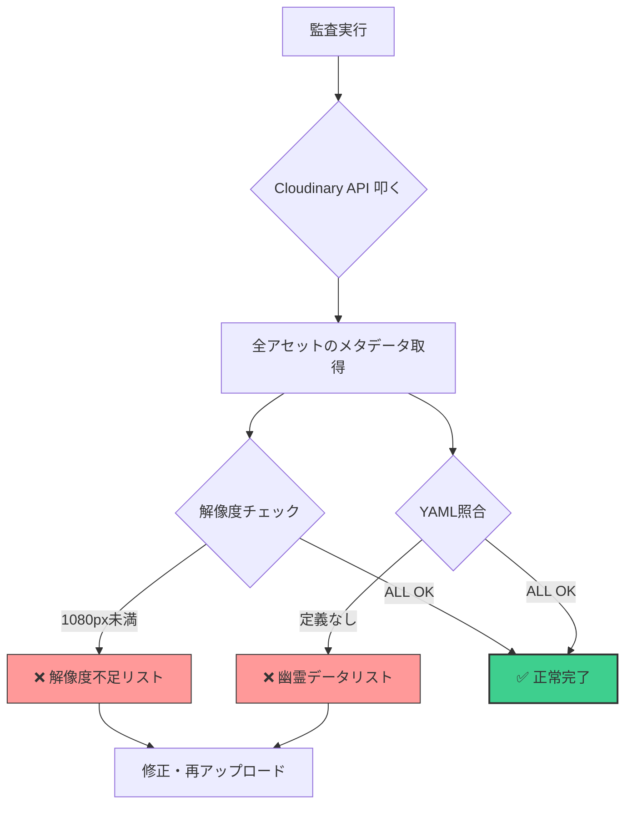
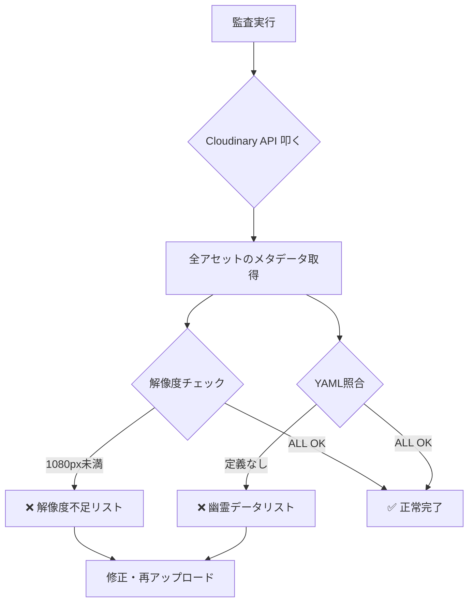

# 🛰️ Cloudinary 資産監査（Audit）ガイド

このドキュメントは、Cloudinary UI（管理画面）を使わずに、API経由でアセットの健康状態（解像度・重複・幽霊データ）を診断するための手順書です。

---

## 1. 監査の目的
Cloudinaryの管理画面は、インデックスの反映が遅れたり、低画質な「負の遺産」が検索に引っかからなかったりすることがあります。
本スクリプトは **API（Search API）** を直接叩くことで、UIという「霧」を払い、実データを白日の下にさらします。

---

## 2. 事前準備
実行には Cloudinary の API 認証情報が必要です。

- **`.env` ファイルの確認:**
  以下の項目が正しく設定されていることを確認してください。
  ```env
  CLOUDINARY_CLOUD_NAME=your_cloud_name
  CLOUDINARY_API_KEY=your_api_key
  CLOUDINARY_API_SECRET=your_api_secret
  ```

---

## 3. 実行コマンド
リポジトリのルートディレクトリから実行します。

### 🚨 基本：解像度の健康診断
特定のフォルダ配下にある画像が、すべて **1080px（高さ）** を満たしているかチェックします。
```bash
python scripts/audit_assets.py --prefix emakimono/choju-giga-yamazaki-kou
```

### 🚨 応用：YAML との整合性チェック
Cloudinary上の実データと、ローカルの `scroll_config.yaml` を突き合わせ、「YAMLに載っていない不要な画像（幽霊）」をあぶり出します。
```bash
python scripts/audit_assets.py --prefix emakimono/choju-giga-yamazaki-kou --yaml scroll_config.yaml
```

---

## 4. 診断結果の読み方

| 項目 | 意味 | 対策 |
| :--- | :--- | :--- |
| **⚠️ 低解像度** | 指定した高さ（デフォルト1080px）に満たない画像。 | 高画質な原画を再アップロードする。 |
| **👻 孤立したデータ** | Cloudinaryにはあるが、YAMLには定義されていない画像。 | `public_id` が間違っているか、古いゴミデータ。 |
| **✅ 正常** | すべてのチェックを通過したエリートアセット。 | そのまま出航（同期）してOK。 |

---

## 5. 監査ワークフロー（図解）




---

## 6. プロの Tips
> **💡 計器を信じろ**
> Cloudinary UIで画像が見つからない時は、消えたのではなく「UIのインデックスが遅れている」だけの場合がほとんどです。このスクリプトで `Public ID` が表示されるなら、画像は確実に「そこにあります」。

> **💡 重複を防ぐ**
> アンダースコアが1つの古いID（`_01`）と、2つの新しいID（`__01`）が混在していないか、このスクリプトの結果を `grep` して確認しましょう。

---

```python
# ds_python_interpreter を使用してファイルを生成
import os

content = """# 🛰️ Cloudinary 資産監査（Audit）ガイド

このドキュメントは、Cloudinary UI（管理画面）を使わずに、API経由でアセットの健康状態（解像度・重複・幽霊データ）を診断するための手順書です。

---

## 1. 監査の目的
Cloudinaryの管理画面は、インデックスの反映が遅れたり、低画質な「負の遺産」が検索に引っかからなかったりすることがあります。
本スクリプトは **API（Search API）** を直接叩くことで、UIという「霧」を払い、実データを白日の下にさらします。

---

## 2. 事前準備
実行には Cloudinary の API 認証情報が必要です。

- **`.env` ファイルの確認:**
  以下の項目が正しく設定されていることを確認してください。
  ```env
  CLOUDINARY_CLOUD_NAME=your_cloud_name
  CLOUDINARY_API_KEY=your_api_key
  CLOUDINARY_API_SECRET=your_api_secret
  ```

---

## 3. 実行コマンド
リポジトリのルートディレクトリから実行します。

### 🚨 基本：解像度の健康診断
特定のフォルダ配下にある画像が、すべて **1080px（高さ）** を満たしているかチェックします。
```bash
python scripts/audit_assets.py --prefix emakimono/choju-giga-yamazaki-kou
```

### 🚨 応用：YAML との整合性チェック
Cloudinary上の実データと、ローカルの `scroll_config.yaml` を突き合わせ、「YAMLに載っていない不要な画像（幽霊）」をあぶり出します。
```bash
python scripts/audit_assets.py --prefix emakimono/choju-giga-yamazaki-kou --yaml scroll_config.yaml
```

---

## 4. 診断結果の読み方

| 項目 | 意味 | 対策 |
| :--- | :--- | :--- |
| **⚠️ 低解像度** | 指定した高さ（デフォルト1080px）に満たない画像。 | 高画質な原画を再アップロードする。 |
| **👻 孤立したデータ** | Cloudinaryにはあるが、YAMLには定義されていない画像。 | `public_id` が間違っているか、古いゴミデータ。 |
| **✅ 正常** | すべてのチェックを通過したエリートアセット。 | そのまま出航（同期）してOK。 |

---

## 5. 監査ワークフロー



---

## 6. プロの Tips
> **💡 計器を信じろ**
> Cloudinary UIで画像が見つからない時は、消えたのではなく「UIのインデックスが遅れている」だけの場合がほとんどです。このスクリプトで `Public ID` が表示されるなら、画像は確実に「そこにあります」。
