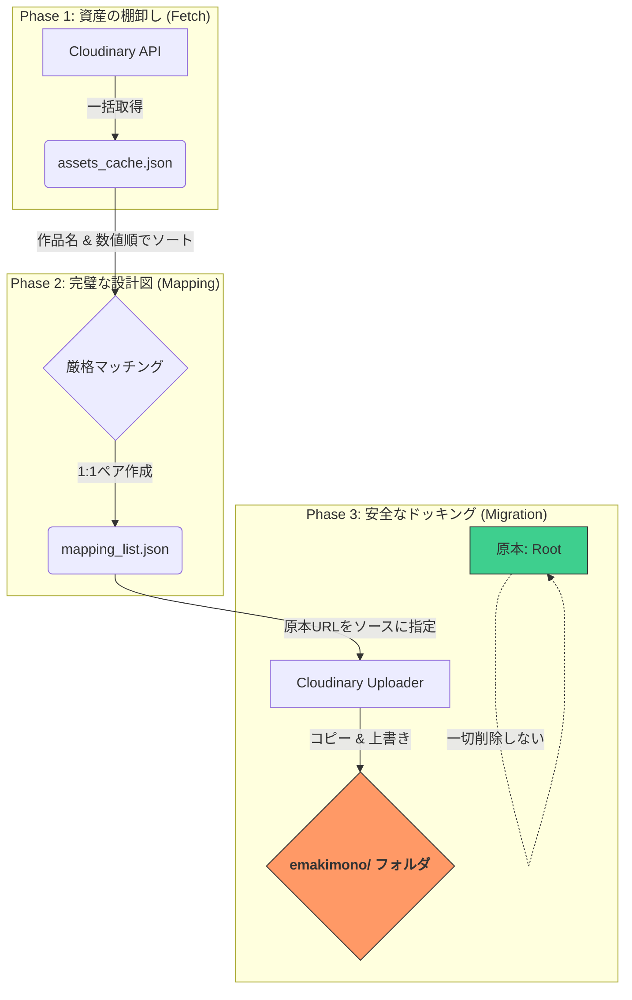

# 🚢 Cloudinary 資産移行指示書：エマキ・アップグレーダー

## 1. プロジェクトの目的
本工程の目的は、Cloudinaryのルートディレクトリにある**「原本（高画質）」**を、`emakimono/` フォルダ内にある構造化された**「ターゲット（低画質ダミー）」**へ、**無停止かつ安全に同期（上書き）**することです。

---

## 2. 処理フロー概略（Mermaid）

---

## 3. 実行前の準備（WORK_MAPの設定）

スクリプト内の `WORK_MAP` 変数に、移行したい作品の「旧キー」と「新キー」を定義します。

* **Key (左)**: 原本ファイル名の先頭文字列（例: `cyoujyuu_yamazaki_otu`）
* **Value (右)**: 新環境での識別ID（例: `choju-giga-yamazaki-otu`）

> [!TIP]
> **「九相図」混同への盾**
> `kusouzu` を処理する際、`kusouzu_eitaku` が混じらないよう、スクリプトは内部で **「完全前方一致 + 直後に数字」** という厳格なガードを敷いています。

---

## 4. 実行の3ステップ

### Step 1: 資産リストの抽出
Cloudinaryから全アセットのメタデータを取得し、`assets_cache.json` を生成します。
* **目的**: API制限を回避し、ローカルで高速にマッチング計算を行うため。

### Step 2: マッピングの自動生成
原本（Root）とダミー（emakimono）を、**「物語の順序（数値インデックス）」**で紐付けます。
* **ソートロジック**:
    * 新パス `__1_02__06` を `(1, 2, 6)` という数値タプルに解体。
    * これにより、文字列ソートでは不可能な「章・節・枝番」の正しい並び順を保証します。

### Step 3: 安全モードによる移行（リモート・コピー）
`rename`（移動）ではなく、`upload`（コピー）コマンドを使用します。
* **原本の保護**: 原本のURLをソースとして新Public IDへ上書きするため、**原本が削除されることはありません。**
* **キャッシュの更新**: `invalidate=True` を指定しているため、ブラウザ側の古いキャッシュも即座に更新されます。

---

## 5. トラブルシューティング & 安全確認

| 事象 | 原因と対策 |
| :--- | :--- |
| **枚数が合わない** | `zip` 関数は少ない方の枚数に合わせて停止します。ログの「原本/ターゲット枚数」を確認してください。 |
| **物語が逆転した** | ファイル名の数字（01, 02...）が途切れているか、特殊記号（21- 等）が干渉しています。`get_root_index` の正規表現を調整してください。 |
| **原本が消えた！** | スクリプトが `rename` を使っていないか確認してください。本手順の `upload` 方式なら物理的にあり得ません。 |

---

## 🗂️ 成果物ファイル
* `assets_cache.json`: Cloudinaryの生データ（一時キャッシュ）
* `mapping_list.json`: 紐付けの結果。**実行前にこのファイルを目視確認すること。**
* `migration_log.json`: 実行後の成功/失敗レポート。
