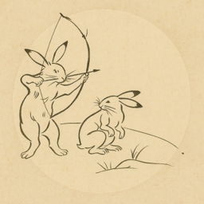

# 📘 絵巻物 ZUKAN 図鑑 / Emakimono ZUKAN Encyclopedia

このディレクトリは、絵巻物に登場するキャラクターや道具を体系的に整理・保存する図鑑です。  
This directory contains a structured encyclopedia of characters and tools appearing in emakimono (traditional Japanese illustrated scrolls).

---

## 🗂 ディレクトリ構成 / Directory Structure

```
zukan/
├── characters/        # キャラクター全般 / All Characters
├── tools/             # 道具・装備 / Tools and Ritual Implements
├── templates/         # テンプレート / Templates for new entries
├── index.json         # 全アイテムのメタ情報一覧 / Index of all items
└── README.md          # このファイル / This README
```

---

## 🧭 使い方 / How to Use

### 🧑‍🎨 キャラクター / Characters
- `characters/{id}/` ディレクトリに、`profile.md`（日英併記の説明）と `metadata.json`（属性情報）を格納してください。  
  Place `profile.md` (bilingual description) and `metadata.json` (attribute info) in each `characters/{id}/` directory.
- 画像は `images/` に `icon.png`（丸抜き）と `full.png`（全身や印象的な構図）を入れてください。  
  Store images such as `icon.png` (face icon) and `full.png` (full-body or expressive visual) in the `images/` folder.

### 🧰 道具 / Tools
- 道具もキャラクターと同様に `tools/{id}/` 以下に情報を整理します。  
  Tools follow the same structure under `tools/{id}/` as characters.

### 🧩 テンプレート / Templates
- 新規アイテム追加時は `templates/character-template.md` または `tool-template.md` を使用してください。  
  Use `templates/character-template.md` or `tool-template.md` when adding new items.

---

## 🛠 index.json について / About `index.json`

`zukan/index.json` はすべてのキャラクター・道具をまとめたメタデータの目次です。  
`zukan/index.json` serves as a metadata index for all characters and tools.

フロントエンドでの一覧表示やリンク生成などに使用します。  
It is used for frontend listings and dynamic link generation.

---

## 📚 登録済みアイテム一覧 / Registered Items

### 🧑‍🎨 Characters

| Icon | Name | Appears in | Path |
|------|------|------------|------|
|  | **壇林皇后 / Empress Danrin** | [九相図巻 / kusouzumaki](https://emakimono.com/ja/Ch%C5%8Dj%C5%AB-jinbutsu-giga_first) | [→ 詳細を見る](./1_characters/danrinkougou/) |

### 🏹 Tools

| Icon | Name | Appears in | Path |
|------|------|------------|------|
|  | **賭弓 / Noriyumi** |  [鳥獣人物戯画 甲巻 / Chōjū-jinbutsu-giga_first](https://emakimono.com/ja/kusouzumaki) | [→ 詳細を見る](./2_tools/noriyumi/) |

## 💬 コントリビューション / Contributions Welcome!

- キャラクターや道具の追加・翻訳・画像提供など、さまざまな形での貢献を歓迎します。  
  Contributions of characters, tools, translations, and image support are welcome.
- フォーマットの不明点がある場合は、テンプレート参照か Issue にてご相談ください。  
  If you're unsure about formatting, please refer to templates or open an issue.

---

## 🌐 関連リンク / Related Links

- [Emakimono Viewer](https://emakimono.com/) – 横スクロールで絵巻物を閲覧できるUI
  Horizontal scroll-based viewer for emakimono.
- [Contribution Roadmap](https://github.com/satoshi-create/emakimono-next/wiki/Contribution-Roadmap) – コントリビュートの全体像
  Overview of how to contribute to this project.

